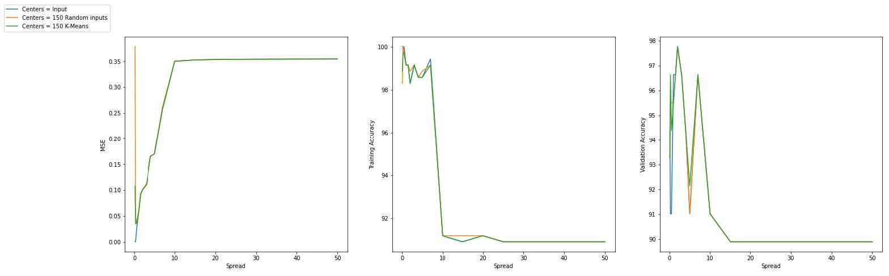
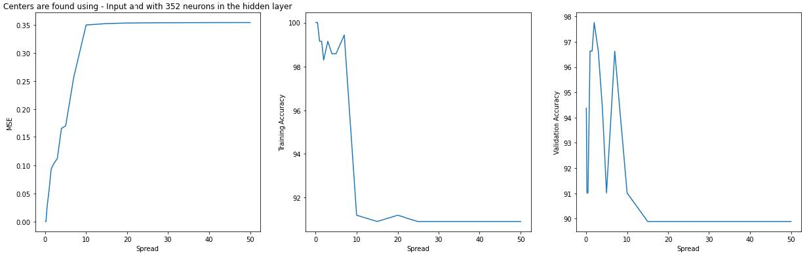
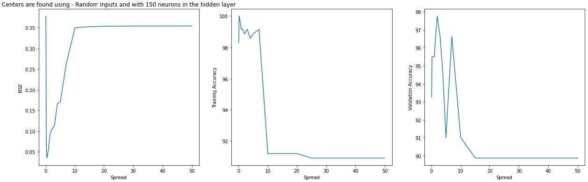
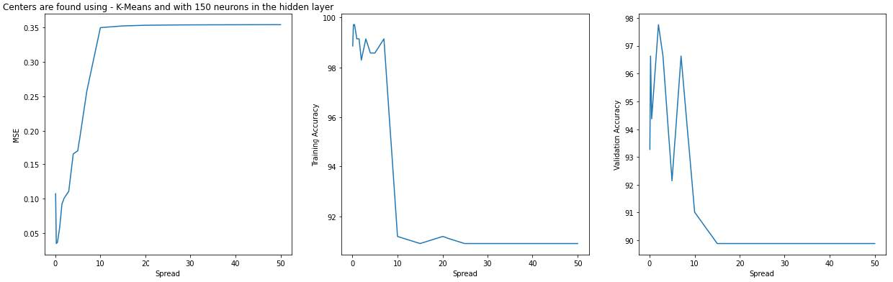

<!-- Reference:
https://github.com/othneildrew/Best-README-Template -->

<!-- PROJECT LOGO -->
 

  <h1 align="center"><i> RBF Neural Network for Map Approximation </i></h1>

  
  
  

    A Radial Basis Neural Network for approximating custom mappings !
  

 

<!-- TABLE OF CONTENTS -->

  
Table of Contents

  <ol>
    <li>
      <a href="#about-the-project">About The Project</a>
    </li>
    <li>
      <a href="#getting-started">Getting Started</a>
    </li>
    <li><a href="#case-study-analysis">Case Study Analysis</a></li>
    <li><a href="#license-or-author">License or Author</a></li>
    <li><a href="#contact">Contact</a></li>
    <li><a href="#acknowledgments">Acknowledgments</a></li>
  </ol>

 

<!-- ABOUT THE PROJECT -->
## About The Project
  This is a closed-form Radial Basis Neural Network for approximating custom mappings using a curve of the user's choice. The network has been created from cratch, and supports different custom configurations and data domains.

  For the purpose of analysis, we also ran the network on a mapping; the results of which can be found in one of the below sections.

  
(<a href="#readme-top">back to top</a>)

## Built With
  &nbsp; &nbsp; &nbsp;  &nbsp; &nbsp;

  &nbsp; &nbsp; &nbsp; <b><i> Python</i></b>

  
(<a href="#readme-top">back to top</a>)

<!-- GETTING STARTED -->
## Getting Started
  #### Prerequisites
  * Python
  * MatPlotLib
  * Numpy
  * Pandas
  * K-Means
  * sklearn
  * pickle

  #### Installation & Use
  1. Get RBFN.py
  2. Import RBF_Neural_Nw in your implementation
  3. Use the functions as per your convinience and configuration.

  
(<a href="#readme-top">back to top</a>)

<!-- USAGE EXAMPLES -->
## Case Study Analysis
  We tried our RBF neural network for the following configuration:
  
  f(x1, x2) = +1, &nbsp; if x12 + x22 <= 1
  
  &nbsp; &nbsp; &nbsp; &nbsp;&nbsp; &nbsp; &nbsp; &nbsp; &nbsp;  -1, &nbsp; &nbsp;if x12 + x22 > 1

  For training, we used 441 randomly sampled data points in the form (xi, xj), such that:
  
  &nbsp; &nbsp; &nbsp; &nbsp; xi = -2 + 0.2 i; &nbsp; &nbsp; i E [0, 20]
  
  &nbsp; &nbsp; &nbsp; &nbsp; xj = -2 + 0.2 j; &nbsp; &nbsp; j E [0, 20]

   
  Following were the results of the network, in their respective settings
  
  * #### 0. With constant Spread:
      

  * #### 1. With varying Spread, and Centers = Inputs Points:
      </img>
      - Mean square Error keeps increasing with increase in ‘Spread’ value & after ‘spread = 10’ stays almost constant
      - Training Accuracies have very little fluctuations initially, and then suddenly drop to around 90 for spread >= 10.
      - Testing (Validation) accuracies follow a trend similar to training, except that the initial fluctuations are large. [The large initial fluctuations are expected, since the validation set may hold new inputs (which were not exposed earlier, during training)]
    
  * #### 2.a. With varying Spread, and Centers = 150 Random Inputs Points:
       </img>
      - Mean square Error keeps increasing with increase in ‘Spread’ value (With the exception of ‘spread = 0.1 to 0.5’ where it actually drops between the 2 points) & after ‘spread = 10’ stays almost constant
      - Training Accuracies – Results are again similar to those achieved in Part-1, except for ‘spread = 0.1 to 0.5’, where it actually goes up by a small margin.
      - Testing (Validation) accuracies – Results are similar to those achieved in Part-1, although not exactly the same.

  * #### 2.b. With varying Spread, and Centers = 150 Points (Found using K-Means Algorithm API):
       </img>
      - The results are similar to those achieved in Part 2.a] and for ‘spread = 0.1 to 0.5’ the change is relatively smaller in case of all 3 parameters.

      
  #### Comparison in performance of the network:
  * As is evident from the graphs, there is very little difference in performance between the 3 different configurations of centers.
  * All the performance parameters (Mean Square Error (MSE), Training Accuracy in %, Validation Accuracy in %) are very similar in each of the configurations.
  * A noticeable difference that we can see between the configurations is only for the initial values of spread. Otherwise, the results are very similar.

  #### Comment on Spread Value:
  * The above results show the importance of ‘Spread’ value in Radial Basis Function Neural Networks.
  * The performance of the network largely varies depending on the spread value, compared to other parameters.
  * A spread value between ‘1’ and ‘2’ appears to provide an efficient result, with good accuracies and low cumulative error - for this case study.

  #### Following Configuration was used:
  * spreads = [0.1, 0.25, 0.5, 1, 1.5, 2, 3, 4, 5, 7, 10, 15, 20, 25, 30, 40, 50]
  * Radial Function = “Gaussian Kernel”, Loss Function = “Mean Square Error”

  
(<a href="#readme-top">back to top</a>)

<!-- LICENSE -->
## License or Author
  * Authored by Uditya Laad, Himalaya Sharma, Dakota Wang - University of Waterloo
  * <b> Case Study</b> : Suggested By Prof. Hatham Amar - University of Waterloo

  
(<a href="#readme-top">back to top</a>)

<!-- CONTACT -->
## Contact
  <b>Uditya Laad</b> &nbsp; [@linkedin.com/in/uditya-laad-222680148](https://www.linkedin.com/in/uditya-laad-222680148/)
  
  &nbsp; &nbsp; &nbsp; &nbsp; &nbsp; &nbsp; &nbsp; &nbsp; &nbsp; &nbsp; &nbsp; &nbsp; [@github.com/udityalaad](https://github.com/udityalaad)
  
  &nbsp; &nbsp; &nbsp; &nbsp; &nbsp; &nbsp; &nbsp; &nbsp; &nbsp; &nbsp; &nbsp; &nbsp; udityalaad123@gmail.com

  <b>Project Link</b> &nbsp; [https://github.com/udityalaad/RBF_NN_for_Map_Approximation](https://github.com/udityalaad/RBF_NN_for_Map_Approximation)

  
(<a href="#readme-top">back to top</a>)

<!-- ACKNOWLEDGMENTS -->
## Acknowledgments
  * ECE 657, Assignment 2, Hatham Amar, University of Waterloo, Waterloo, ON, CA
  * [github.com/othneildrew/Best-README-Template/](https://github.com/othneildrew/Best-README-Template)
  * [Radial Basis Function Neural Network in Machine Learning - Rupika Nimbalkar, Medium](https://medium.com/appengine-ai/radial-basis-function-neural-network-in-machine-learning-fe4a4fa0a92f)

  
(<a href="#readme-top">back to top</a>)

